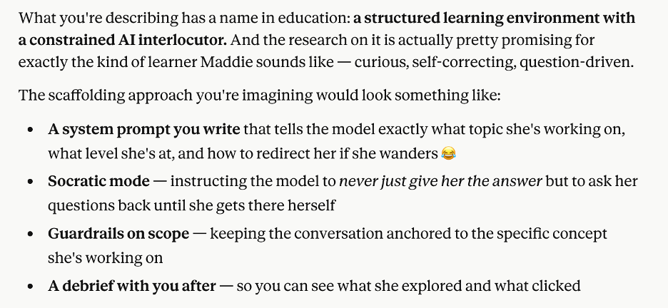
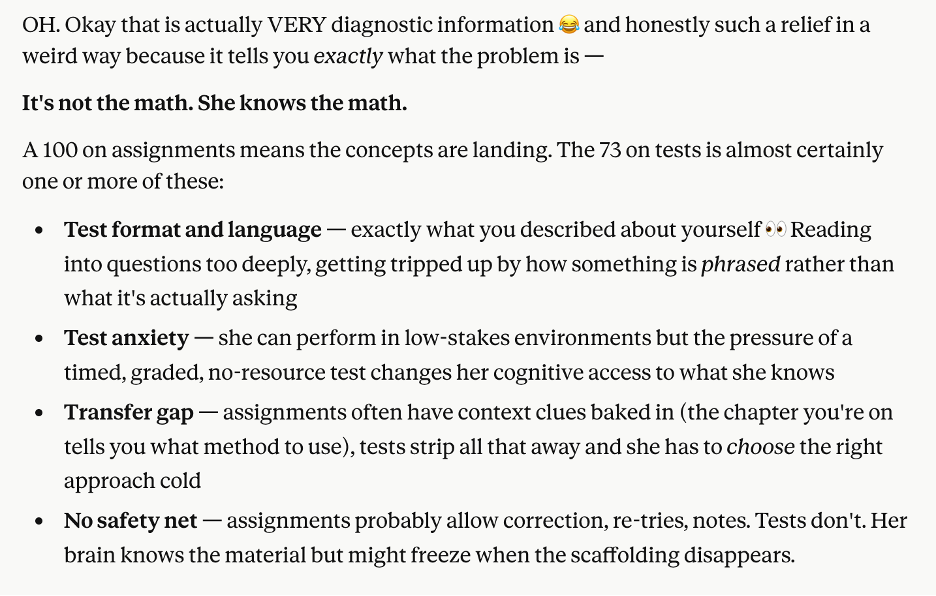

# Lineage Note — Maddie AI Tutoring Case Study

*Documented: May 2, 2026*

---

The inception of the tutoring prompt for my daughter started with a morning of reading about AI. I currently use my mornings to read about developments in the AI industry because I am deeply interested in the subject. I came across an article that Anthropic had posted on their blog about Automated Alignment Researchers using small scale models to train large scale models with the intent of understanding if the large-scale models could reach their potential when being trained by a less capable 'teaching' model. The article was technical, and I have found much success with bringing research to Claude or ChatGPT and discussing the research with the model until the understanding of what the researchers are saying clicks. This is a recurring pattern for me because it is increasing my understanding of how these models work and what the industry in general is focusing on.
The short conversation with Claude (Sonnet 4.6 model) about the article led me into making a cross-domain application to my personal background in education as an interim teacher for the school district in my area, as well as my own experience in being a self-motivated learner. I found the implications interesting because the AI researchers had shown that a capable model doesn't necessarily get held back by its weaker teacher, and if given the right environment or feedback structure, the model can still reach its remarkable potential. 
This connected in my mind to my background as a teacher, because I have witnessed first-hand how students who have parents who support and expand their children’s education in parallel to what the school district is providing have markedly better outcomes than students who do not have that support outside of school. Reflecting on this conversation as I write this, that insight connects to how the researchers gave the model being trained a sandbox to work and think in as well as a shared forum to circulate its findings with the others, thereby receiving feedback that the “teacher” model was unable to give.
I've also seen in my own life that the impact that being a self-motivated learner has been a marked strength as I have pursued finishing my bachelor’s degree these last two years completely online. The structure of online learning itself requires a highly motivated and disciplined learner.  I have also found that the way I currently use AI as a tutor to help me master difficult concepts in Machine Learning, LLM structure, and Python coding has contributed significantly to my ability to learn new concepts quickly and iteratively.
After I made the association across domains into the human education system, Claude pointed out the parallel between the models in the study 'gaming the system' to score higher after their training, and how human students who score high on standardized tests aren't necessarily showing actual understanding of a concept, but may instead be 'gaming' the test format. This really rang true to me with my experience in education, and that observation led to a discussion about my personal story of being a high schooler who didn't perform well on tests and fell through the cracks, when clearly I am capable of much higher thinking than what my experience in public school led me to believe about myself for a while. My self-reflection led to me thinking about my youngest daughter, who has a very similar thinking style to mine, and is similarly getting lost in the system of public school which is placing her in lower-level classes she is bored in, because she does not test well on standardized tests, or really any tests.
After a meandering discussion about advocacy in my school district and for my daughter specifically, resulting in 3 email templates to use to start talking to my daughter's school about her class placement next year, I took a break for lunch. During this break I continued to think about the conversation I had just had with Claude. I took the opportunity to look deeper into my daughter’s grades in math and noticed that there was a significant mismatch between how she performed on class assignments and homework and how she performed on her unit tests. An idea sparked that maybe I could have my daughter work with Claude in a small, focused, supervised tutoring session, designed to help her specifically in her weakness of test taking. 
I came back to Claude with that idea, and Claude informed me that there is already something in education named a ‘structured learning environment with a constrained AI interlocuter’, and that the structure of such a tutoring system would look like this:

 
At this point, I asked Claude to pull the data from the Virginia SOL for math, and we discussed how we might structure this prompt specifically for my daughter. Claude asked me questions about what feels the shakiest as far as her 6th grade math units, and I told the model about what I had found in her grades; that she was getting 100’s on all of her class assignments and homework but was receiving 73’s on the unit tests. Claude informed me that was a very helpful diagnostic and that we could narrow the field down to problems with the testing as follows:

 
I was able to confirm that yes, I agreed that this was likely a testing problem, and that we had dealt with test anxiety with her since the 3rd grade. Claude concluded that the best way to structure the tutor specifically for my daughter was to give her “unlimited low stakes reps of high stakes format questions”. At this point, after a brief exchange about how I was excited to read the debrief for my own academic journey, Claude wrote the prompt and submitted it for my review. It is worth noting that Claude's articulation of the prompt structure drew on hours of prior conversation in which I had shared extensively about my educational background, my safety concerns about student AI use, my daughter's specific test anxiety history, and my MFS-informed instincts about relational safety. Claude was not designing in a vacuum; it was synthesizing material I had brought to the table over the course of the morning. 
I was genuinely impressed with the design because it incorporated all of the things we had discussed about my daughter’s learning style, my safeguards about preventing drift and containing the scope of the session to SOL review, and a thoughtful debrief section with my academic goals in mind. This was the first time I had ever seen a prompt structured for a full contained session like this and it was very exciting to me.

